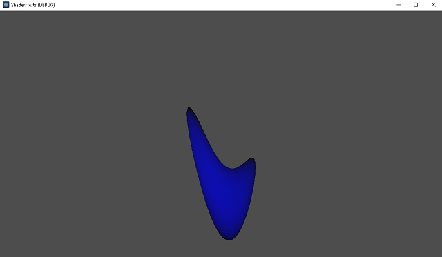

Testing shaders with Godot version 4.1.x .

You can find videos with these shaders on [my youtube channel](https://www.youtube.com/@catafest).

Example of shaders in this github repo:
 - SpatialShaderSphere001
 - OldTV001
 - Water001
 - Candle_2D_001

You can follow me on the web under the nicknames: **catafest** and **mythcat**

My Google website: https://sites.google.com/view/festila-george-catalin
